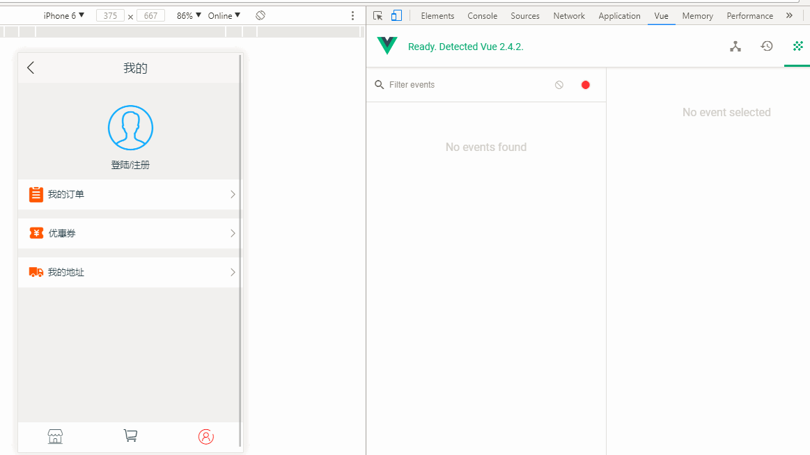
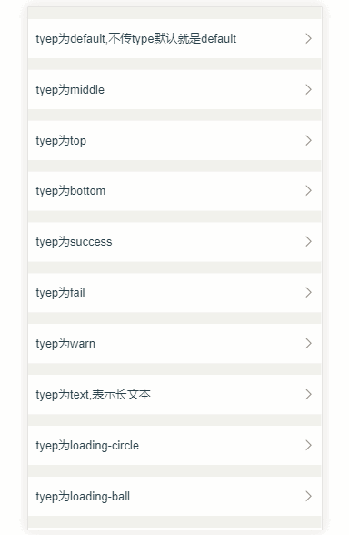

# VueDialog
> A mobile Vue plugin for VueDialog

> pluginName:  VueDialog

> version: 1.0.0

> author:	Alan Chen

> github:	alanchenchen@github.com

> date:	2017/12/13

#### This plugin is just only adapted for mobile.

> Please go to the release to see version logs.

## What you can do with the plugin
* You can use it to make several kinds of dialog components such as `Alert`,`Confirm`,`ActionSheet`,`Toast`.And you can also use the components like `AddressPicker`,`Loading` and `Scroller`

 

[中文文档](./ChineaseREADME.md)
## How to use
* NPM install the VueDialog plugin
```node
npm install VueDialog --save
```

#### 1.vue spa
* import the plugin and use **(global use)**

``` javascript 
import {VueDialog} from 'VueDialog'
Vue.use(VueDialog)
```

* import some components that you need and use **(local use)**

``` javascript 
import {Scroller,Alert,Confirm} from 'VueDialog'
Vue.component(Scroller.name,Scroller)
Vue.component(Alert.name,Alert)
Vue.component(Confirm.name,Confirm)
```

#### 2.script html
* directly write the script,in deed you have to `insert the vue.js` script firstly  

``` html 
<script src="dist/VueDialog.js"></script>
```

* use the components directly in your vue spa file or the Vue instance ,like

``` html 
<Alert />
<Confirm />
<Toast />
<Scroller />
...
```


## Options
### 1. Alert
#### props
 *alert* `[Object]`

| key         |            value                         |description|
|:-----------:|:----------------------------------------:|:------:|
| title       | `[String]` or `[HTML Tag]`   |   title of the alert   |
| content     | `[String]` or `[HTML Tag]`|   content of the alert    |
| alertBtn    | `[String]`|     alertBtn of the alert    |
| isShow      | `[Boolean]`|   whether show the alert  |

*closeOnClickModal* `[Boolean]`

| prop name  |      description                         |required| default |
|:-----------:|:----------------------------------------:|:------:|:-------:|
| `closeOnClickModal` | `[Boolean]`whether close alert by clicking the mask modal   |   No   |  false  |

#### emit events
* `ok ` when you click the alertBtn,the component will close. 

#### DEMO Codes
```javascript
//template
<Alert :alert="alert" :closeOnClickModal="true" @ok="ok" />

//script
export default {
	data(){
		return{
			alert:{
				title:'tip',
				content:'Hello World!'
				alertBtn:'Happy',
				isShow:false
			}
		}
	},
	methods:{
		ok(){
			console.log('I click the alertBtn~')
		}
	}
}
```

### 2. Confirm
#### props
 *confirm* `[Object]`

| key         |            value                         |description|
|:-----------:|:----------------------------------------:|:------:|
| title       | `[String]` or `[HTML Tag]`   |   title of the Confirm   |
| content     | `[String]` or `[HTML Tag]`|   content of the Confirm    |
| cancelBtn    | `[String]`|     cancelBtn of the Confirm    |
| confirmBtn    | `[String]`|     confirmBtn of the Confirm    |
| isShow      | `[Boolean]`|   whether show the Confirm  |

*closeOnClickModal* `[Boolean]`

| prop name  |      description                         |required| default |
|:-----------:|:----------------------------------------:|:------:|:-------:|
| `closeOnClickModal` | `[Boolean]`whether close Confirm by clicking the mask modal   |   No   |  false  |

#### emit events
* `ok ` when you click the confirmBtn,the component will close. 
* `cancel ` when you click the cancelBtn,the component will close.

#### DEMO Codes
```javascript
//template
<Confirm :confirm="confirm" :closeOnClickModal="true" @ok="ok" @cancel="cancel" />

//script
export default {
	data(){
		return{
			confirm:{
				title:'tip',
				content:'Are you sure to close the window?'
				confirmBtn:'Yes,please',
				cancelBtn:"No,thanks"
				isShow:false
			}
		}
	},
	methods:{
		ok(){
			console.log('I click the confirmBtn~')
		},
		cancel(){
			console.log('I click the cancelBtn~')
		}
	}
}
```

### 3. Toast



#### props
 *toast* `[Object]`

| key         |            value                         |description| required | default |
|:-----------:|:----------------------------------------:|:---------:|:--------:|:-------:|
| time       | `[Number]`  |control the time of the Toast | No | 500 |
| type     | `[String]`| how to show Toast,has 12 types | No | default |
| content    | `[String]` or `[HTML Tag]`|     content of the Toast    | Yes | / |
| isShow      | `[Boolean]`|   whether show the Toast  | Yes | / |

`type`

| type name |           description                       |
|:---------:|:-----------------------------------------:|
|    top    | slide from the top |
|    bottom | slide from the bottom |
|    default    | show on the window of 30% |
|    middle    | show on the window of 50% |
|    succes    | show with success icon |
|    fail    | show with fail icon |
|    warn    | show with warn icon |
|    text    | show with lots of words |
|    loading-circle    | show with a circle loading |
|    loading-ball    | show with a ball loading |
|    loading-wave    | show with a wave loading |
|    mini-loading    | show with a mini loading |

#### DEMO Codes
```javascript
//template
<Toast :toast="toast" />

//script
export default {
	data(){
		return{
			toast:{
				isShow:false,
				time:2000,
				content:'waiting to delete...',
				type:'mini-loading'
			}
		}
	}
}
```

### 4. ActionSheet
#### props
 *actionSheet* `[Object]`

| key         |            value                         |description|
|:-----------:|:----------------------------------------:|:------:|
| menu       | `[Array - Object]` |   items and the content of the ActionSheet   |
| isShow      | `[Boolean]`|   whether show the ActionSheet  |

> menu must has structure like `[label:'del',content:'delete the data']`

*cancelMode* `[Boolean]`

| prop name  |      description                         |required| default |
|:-----------:|:----------------------------------------:|:------:|:-------:|
| `cancelMode` | `[Boolean]`whether show the cancel item   |   No   |  false  |

*closeOnClickModal* `[Boolean]`

| prop name  |      description                         |required| default |
|:-----------:|:----------------------------------------:|:------:|:-------:|
| `closeOnClickModal` | `[Boolean]`whether close ActionSheet by clicking the mask modal   |   No   |  false  |


#### emit events
* `cancel ` when you click the cancel item (make sure you turn on the cancelMode).
* Other emit events depends on  the label of menu(actionSheet).Such as :
```javascript
 actionSheet:{
	isShow:false,
	menu:[
		{label:'title',content:`<span style=color:blue>Sure？</span><br /><span style=color:#bbb;font-size:12px>You will delete the data...</span>`},
		{label:'remain',content:'No,i wanna remain'},
		{label:'del',content:`<p style=color:red>Yes,delete it!`}
	]
	/*
	 * ActionSheet has 2 emit evnets like 'remain' and 'del'.Attention! The label 'title' won't return emit event!
	 */
}
```


#### DEMO Codes
```javascript
//template
	<ActionSheet 
		:actionSheet="actionSheet" 
		:cancelMode="cancelMode" 
		@del="del"
		@remain="remain"
		@cancel="cancel"
	/>

//script
export default {
	data(){
		return{
			actionSheet:{
				isShow:false,
				menu:[
					{label:'title',content:`<span style=color:blue>Sure？</span><br /><span style=color:#bbb;font-size:12px>You will delete the data...</span>`},
					{label:'remain',content:'No,i wanna remain'},
					{label:'del',content:`<p style=color:red>Yes,delete it!`}
				]
			}	
		}
	},
	methods:{
		del(){
			console.log('I delete the data~')
		},
		remain(){
			console.log('I remain the data~')
		},
		cancel(){
			console.log('I click the cancel item~')
		}
	}
}
```

### 5. Loading
#### props
| prop name  |      description                         |required| default |
|:-----------:|:----------------------------------------:|:------:|:-------:|
| `loading` | `[Boolean]`whether show the Loading   |   Yes   |  /  |

#### DEMO Codes
```javascript
//template
	<Loading :loading="loading" />

//script
export default {
	data(){
		return{
			loading:false
		}
	},
	created(){
		this.loading = true;
		//request for data
		this.$http.post('test/productDetail',{}).then(
			res => {
				//if the data has been loaded. make the loading false
				...
				this.loading = false
			}
		).catch(
			err =>console.log(err)
		)
	}
}
```

### 6. AddressPicker
#### props
| prop name  |      description                         |required| default |
|:-----------:|:----------------------------------------:|:------:|:-------:|
| `addressShow` | `[Boolean]`whether show the AddressPicker   |   Yes   |  /  |


#### emit events
* `ok ` when you click the sure button,the AddressPicker will close and return the address data as the event param.
* `cancel ` when you click the cancel button,the AddressPicker will close.


#### DEMO Codes
```javascript
//template
	<AddressPicker 
		:addressShow="addressShow" 
		@ok="ok" 
		@cancel="addressShow=false" 
	/>

//script
export default {
	data(){
		return{
			addressShow:false
		}
	},
	methods:{
		ok(cont){
			this.addressShow = false
			alert(`You choose ${cont.province}-${cont.city}-${cont.town || ''})
		},
	}
}
```
> Attention: if there is not town ,the return param doesn't inclucde 'town' key!

**Please go the [AddressPicker](https://github.com/alanchenchen/vue-address-picker) to see the details.**

### 7. Scroller

**Please go the [v-scroller](https://github.com/alanchenchen/v-scroller) to see the details.**
